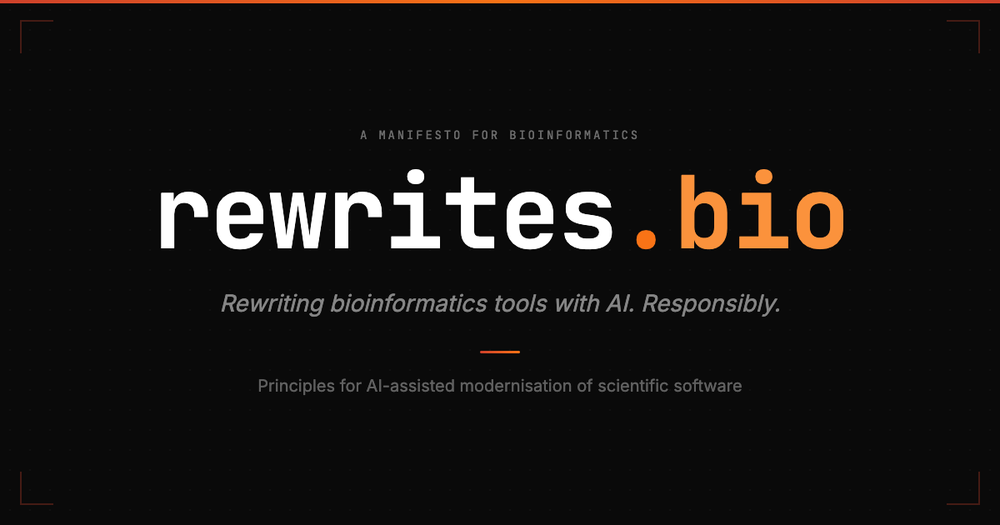

<h1 align="center">
  <a href="https://rewrites.bio"></a>
</h1>

## Rewrite it: Bioinformatics edition

A manifesto for AI-assisted modernisation of bioinformatics software.

Live site: [rewrites.bio](https://rewrites.bio)


## Development

```sh
npm install
npm run dev       # Start dev server at localhost:4321
npm run build     # Build to ./dist/
npm run preview   # Preview production build
```

## Content

All manifesto principles and project listings are defined in YAML:

- **`src/data/manifesto.yaml`** — Manifesto sections and principles
- **`src/data/projects.yaml`** — Rewrite projects and libraries

Edit these files to update the site content. Section numbering (I, II, 1.1, 1.2, etc.) is generated automatically. Principle descriptions are parsed as markdown, so you can use links and formatting.

Plain-text `.md` versions of each page are generated at build time from the YAML data (via `scripts/generate-markdown.mjs`). These are served at `/manifesto.md` and `/projects.md`. A Netlify Edge Function also serves them automatically when a client sends `Accept: text/markdown` or `Accept: text/plain`.

## Deployment

Configured for Netlify (see `netlify.toml`). Push to `main` to deploy.

## License

Open source under the [MIT License](LICENSE).
