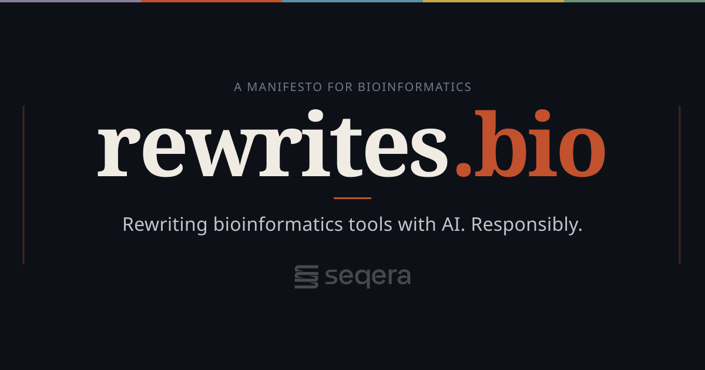

<h1 align="center">
  <a href="https://rewrites.bio"></a>
</h1>

## rewrites.bio

A manifesto for AI-assisted modernisation of bioinformatics software.

Live site: [https://rewrites.bio](https://rewrites.bio)


## Development

```sh
npm install
npm run dev       # Start dev server at localhost:4321
npm run build     # Build to ./dist/
npm run preview   # Preview production build
```

## Content

All manifesto content lives in the Astro source files (`src/pages/index.astro` and components). At build time, a post-build script converts the rendered HTML to clean markdown for LLM consumption:

- **`/manifesto.md`** — Full manifesto in markdown
- **`/llms-full.txt`** — Full manifesto in one file (copy of manifesto.md, for llms-full.txt consumers)
- **`/llms.txt`** — LLM-friendly site index
- **`/.well-known/agent.md`** — AI agent discovery

## Deployment

Configured for Netlify (see `netlify.toml`). Push to `main` to deploy.

## DNS for AI Discovery (DNS-AID)

Agent discovery via DNS requires SVCB/HTTPS records under `_agents.rewrites.bio` plus DNSSEC. Netlify DNS does not support those record types — see [`dns/README.md`](dns/README.md) and run `./scripts/publish-dns-aid.sh` with Cloudflare (or delegate `_agents.rewrites.bio` to a provider that supports SVCB).

## License

Open source under the [MIT License](LICENSE).
